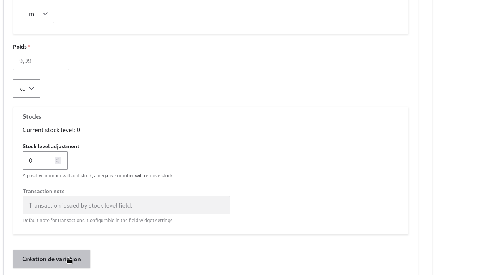

# Variations

## definition

cela represente les changements dans les caractéristiques physiques d'un produit, comme la taille, la couleur, le poids, le design, etc.

## comment les ajouter 

sur la page d'ajout du produit vu precedemment il surffit de de scroller au fond de la page pour voir le bloc variations

<figure class="figure">
  
  <figcaption class="figure-caption"> variation . </figcaption>
</figure>

ayant entré toutes les information, il faut s'assurer de creer la variation avant de sauvegarder le produit sur le bout comme suit

<figure class="figure">
  
  <figcaption class="figure-caption"> variation . </figcaption>
</figure>

et enfin sauvegarder le produit.