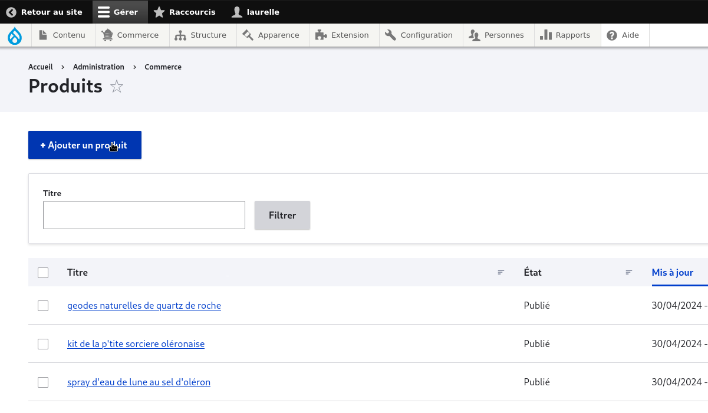
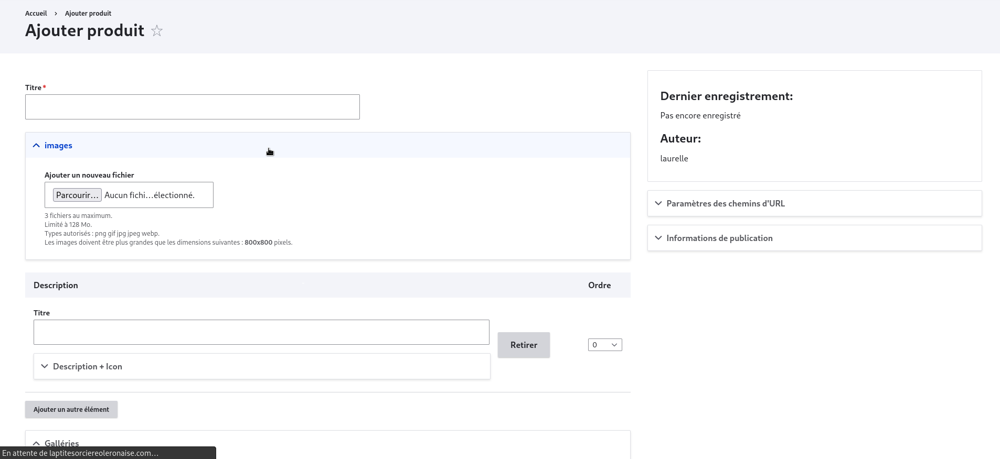

# ajout des produits

Pour pouvoir ajouter un produit il faut se rendre à l'onglet "commerce" et selectionner "produit"

<figure class="figure">
  
  <figcaption class="figure-caption"> commerce. </figcaption>
</figure>

ensuite sur la page ouverte cliquer sur le bouton "ajouter le produit"

<figure class="figure">
  
  <figcaption class="figure-caption"> produit. </figcaption>
</figure>

puis remplir les informations suivantes 

<figure class="figure">
  
  <figcaption class="figure-caption"> produit. </figcaption>
</figure>

avant d'enregistrer nous allons entrer les variations 