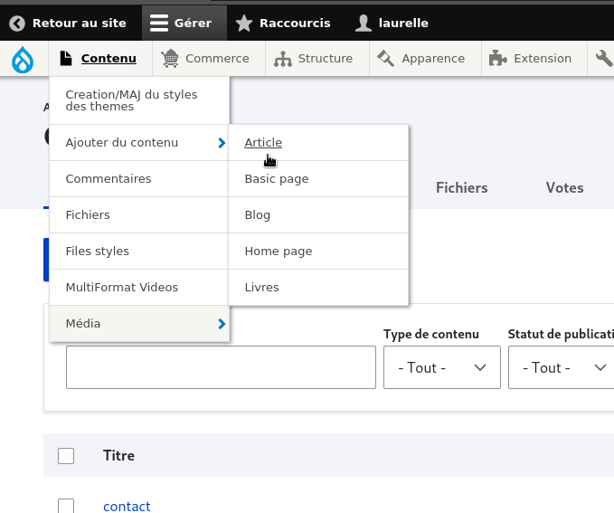
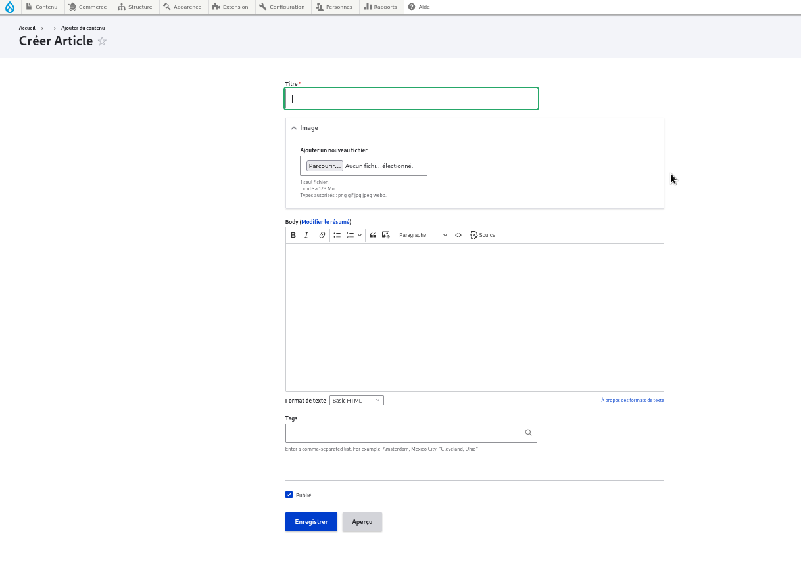

# AJout des blogs

Allez dans la section Contenu et cliquez sur Ajouter du contenu.

Sélectionnez Article parmi les types de contenu disponibles.
<figure class="figure">
  
  <figcaption class="figure-caption">  </figcaption>
</figure>

Remplissez les champs nécessaires :
•Titre: Donnez un titre à votre article.

•  Corps : Ajoutez le contenu de votre article ici.

•  Balises ou tags (optionnel) : Ajoutez des étiquettes pour organiser vos articles.

Vous pouvez également définir des options de promotion, comme mettre l'article en avant sur la page d'accueil ou le coller en haut de la liste des articles.
<figure class="figure">
  
  <figcaption class="figure-caption">  </figcaption>
</figure>
 
Une fois que vous avez terminé, cliquez sur Enregistrer pour publier votre article.

C'est aussi simple que cela ! Votre nouvel article sera maintenant visible sur votre site Drupal