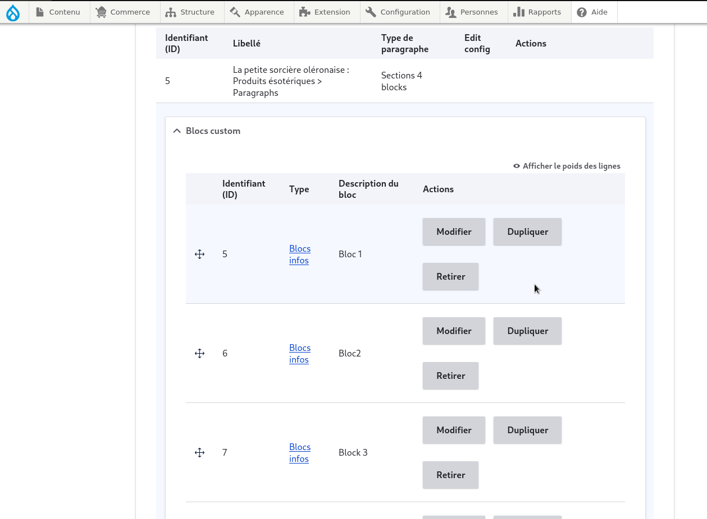
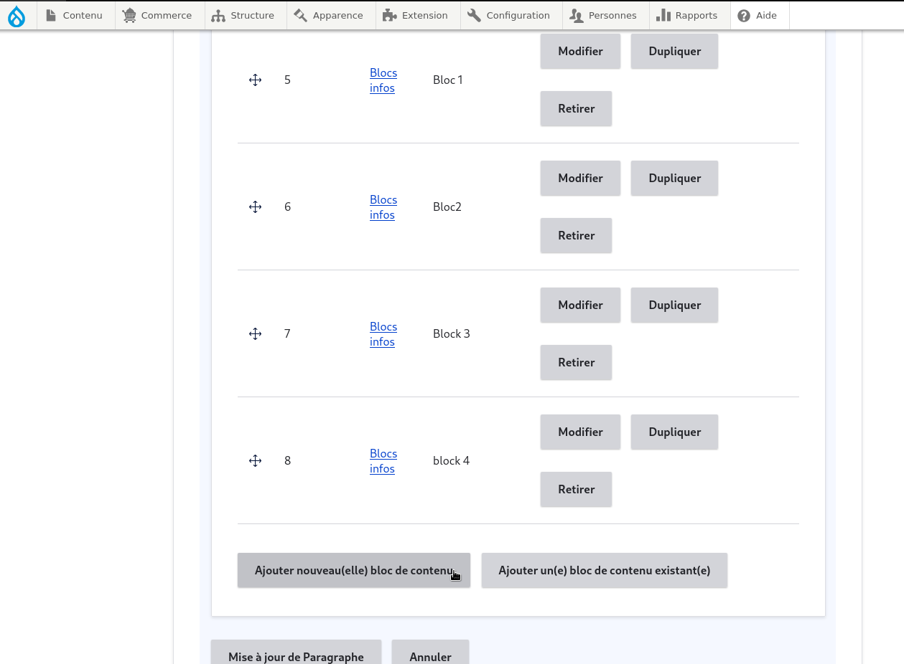

# AJout des blogs

pour ajouter des blogs à une section il suffit de se rendre sur la page à modifier et cibler la section contenant un champs reference à des blocs 

<figure class="figure" >
  
  <figcaption class="figure-caption"> on se rend dans taxonomies </figcaption>
</figure>

vous pouvez soit modifier des blogs presents , soit en ajouter des blogs existant ou des nouveau ou encore retirer des blogs

<figure class="figure" >
  
  <figcaption class="figure-caption"> on se rend dans taxonomies </figcaption>
</figure>

ensuite enregistrer la section et la page par apres