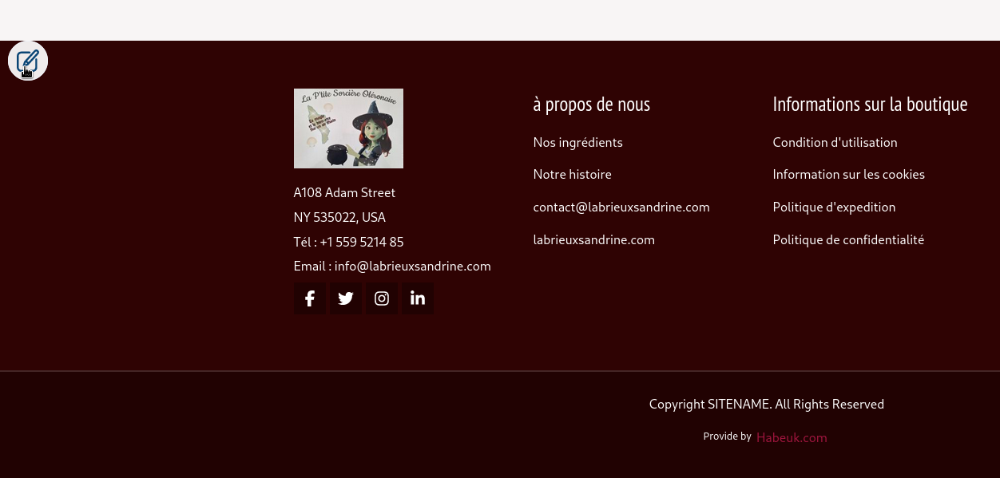
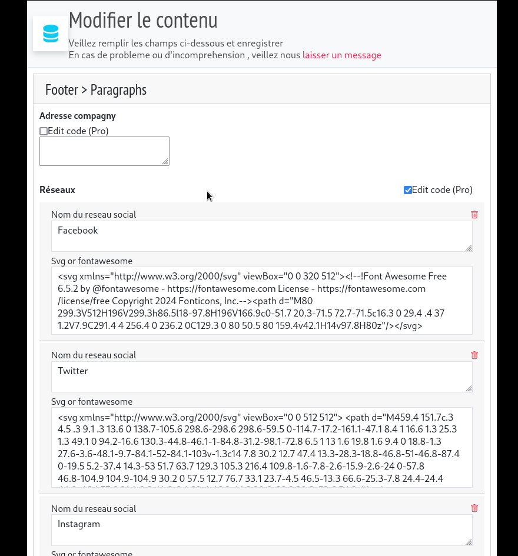

#modification du footer 

pour modifier le footer il suffit de survoler le coin gauche du footer pour avoir acces à un crayon de grande taille qui vous permet d'avoir acces aux modifications rapides

<figure class="figure" >
  
  <figcaption class="figure-caption"> on se rend dans taxonomies </figcaption>
</figure>

et la fenetre suivante apparaitra 

<figure class="figure" >
  
  <figcaption class="figure-caption"> on se rend dans taxonomies </figcaption>
</figure>

puis rentrer toutes les informatio,s et cliquer sur enregistrer

