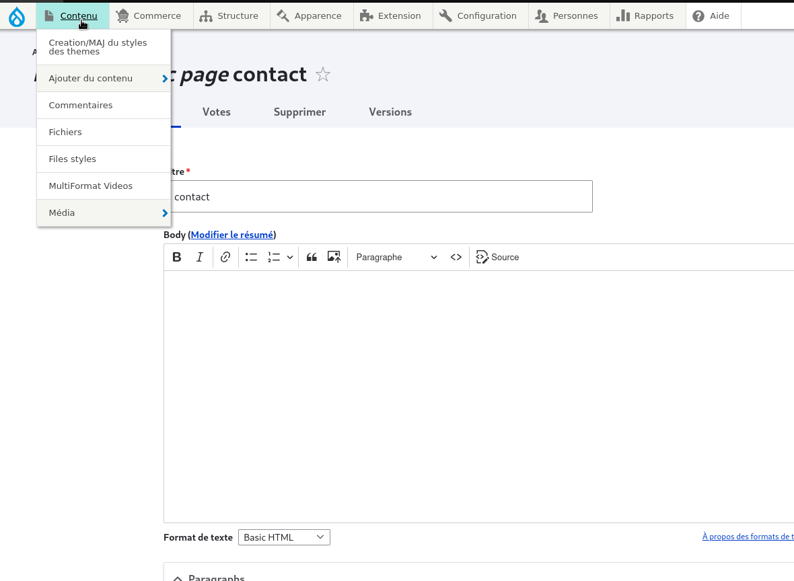

# modification du footer 

pour modifier le footer il suffit de se rendre à l'onglet contenu

<figure class="figure" >
  
  <figcaption class="figure-caption"> on se rend dans taxonomies </figcaption>
</figure>

puis on clique sur l'onglet blocs situé à coté de l'onglet contenu

<figure class="figure" >
  
  <figcaption class="figure-caption"> on se rend dans taxonomies </figcaption>
</figure>

puis on selectionne le footer et on clique sur le bouton gris modifier situé à 

<figure class="figure" >
  
  <figcaption class="figure-caption"> on se rend dans taxonomies </figcaption>
</figure>

puis rentrer toutes les informations et cliquer sur enregistrer

