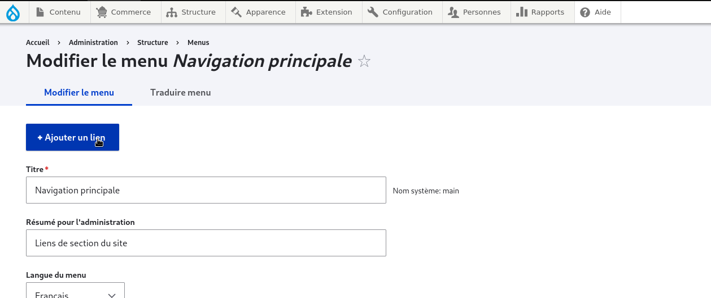
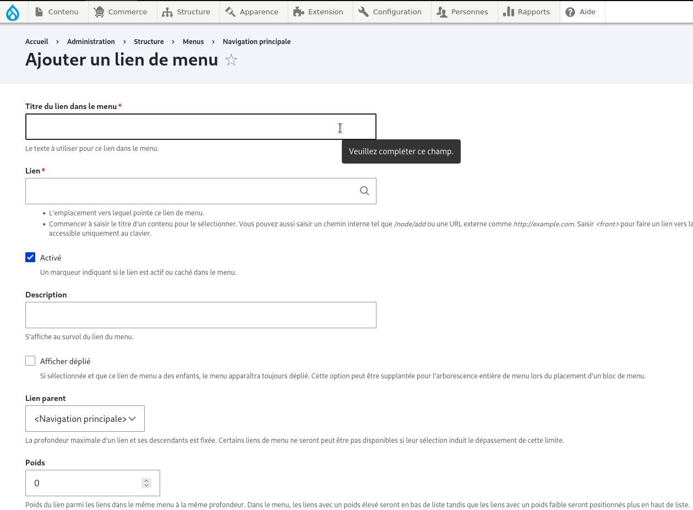
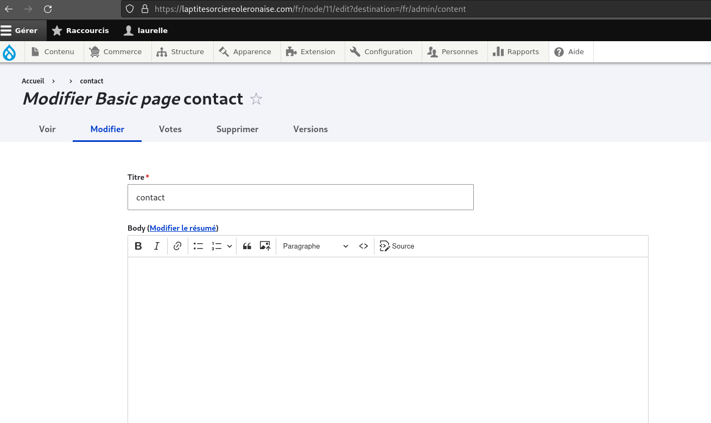
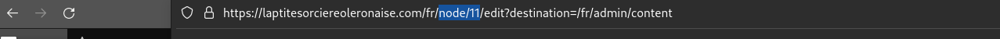

# modification d'un menu

pour pouvoir modifier un menu il faut se rendre sur l'onglet "structure" puis "menu" puis navigation principale 

<figure class="figure" >
  
  <figcaption class="figure-caption"> </figcaption>
</figure>

puis vous avez la possibilité d'ajouter ou de retirer un lien à votre guise 

<figure class="figure" >
  
  <figcaption class="figure-caption"> </figcaption>
</figure>

puis lui definir un titre (qui apparaitra sur le menu ) et un lien 

<figure class="figure" >
  
  <figcaption class="figure-caption"> </figcaption>
</figure>

pour ajouter le lien de la page dans le menu il faut d'abord étant sur page de modification de la page recuperer l'alias d'url situé dans le lien de la page (il sagit de l'élement nommé "node" suivi d'un numero)

<figure class="figure">
  
  <figcaption class="figure-caption">  </figcaption>
</figure>

<figure class="figure">
  
  <figcaption class="figure-caption">  </figcaption>
</figure>

Ensuite pour l'ajouter sur le menu il faut se rendre su l'onglet structure puis sur menu ensuite sur navigation principale

<figure class="figure">
  
  <figcaption class="figure-caption">  </figcaption>
</figure>

<figure class="figure" >
  
  <figcaption class="figure-caption"> </figcaption>
</figure>

ensuite on lui donne un titre qui est le nom de page creer puisque c'est lui qui s'affichera sur le menu

<figure class="figure" >
  
  <figcaption class="figure-caption"> </figcaption>
</figure>

puis sauvegarder