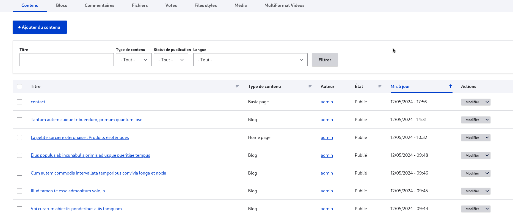
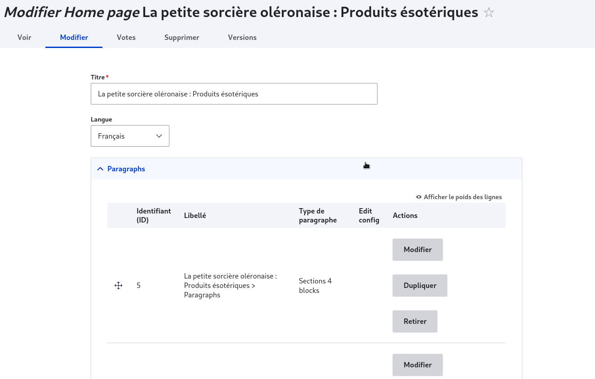
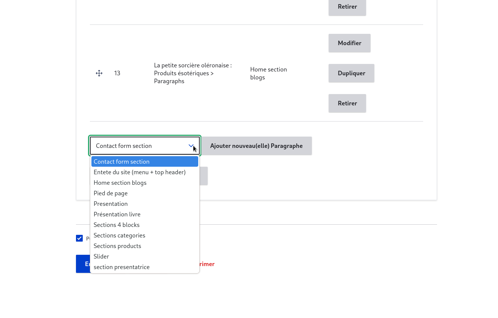
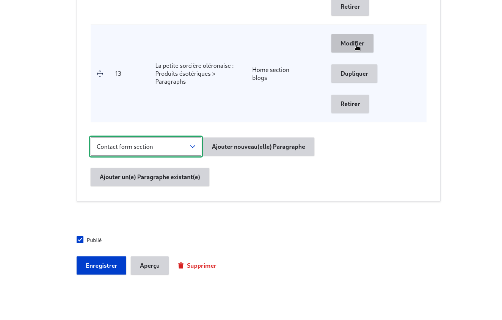
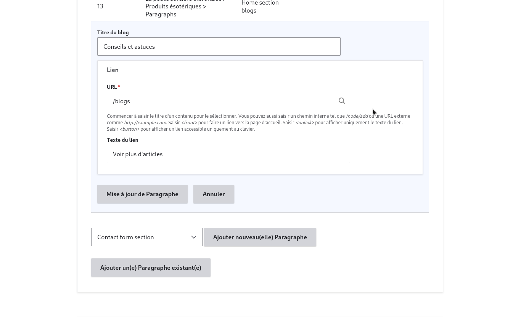
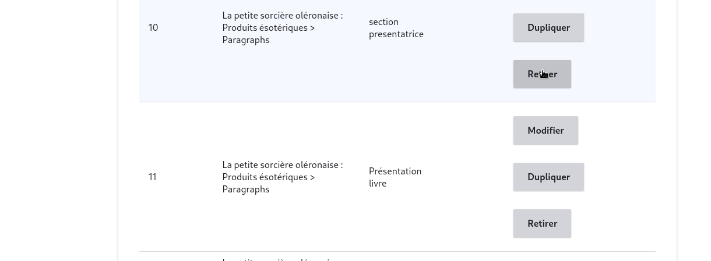
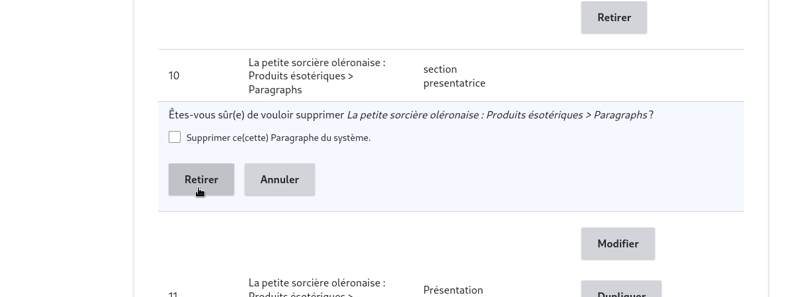

# modification-page.

pour modifier une page il suffit de se rendre dans l'onglet "contenue (content)

<figure class="figure">
  
  <figcaption class="figure-caption">  </figcaption>
</figure>

puis selectionner la page à modifier et cliquer sur modifier

<figure class="figure">
  
  <figcaption class="figure-caption"> </figcaption>
</figure>

il apparaitra alors une page comme celle suivante 

<figure class="figure">
  
  <figcaption class="figure-caption"> </figcaption>
</figure>

vous avez donc la possible de faire plusieur ation

## ajouter une section 

pour ajouter une section il suffit de se rendre au bas de la page et derouler la liste des section ou cliquer sur "ajouter une section existante"

<figure class="figure">
  
  <figcaption class="figure-caption"> </figcaption>
</figure>

## modification d'une section 

pour modifier une section il suffit de cliquer sur le bouton modifier à droite de la section 

<figure class="figure">
  
  <figcaption class="figure-caption"> </figcaption>
</figure>

puis remplir les champs de la section 

<figure class="figure">
  
  <figcaption class="figure-caption"> </figcaption>
</figure>

ensuite enregistrer la section et enregistrer la page 

## suppression d'une section 

pour supprimer une section il suffit de cliquer sur le bout "retirer" à droite de la section

<figure class="figure">
  
  <figcaption class="figure-caption"> </figcaption>
</figure>

puis il apparait une fenetre comme suit 

<figure class="figure">
  
  <figcaption class="figure-caption"> </figcaption>
</figure>

cliquer sur retire et sauvegarder la page