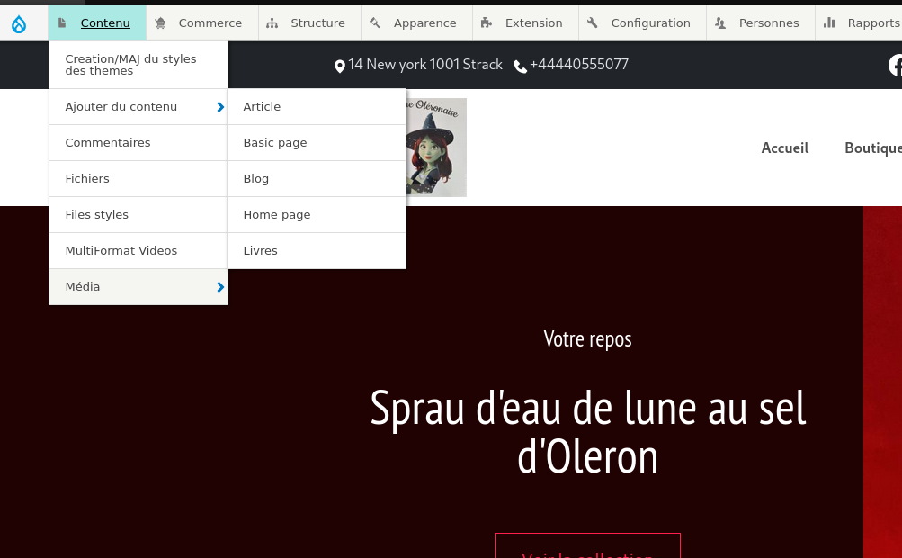
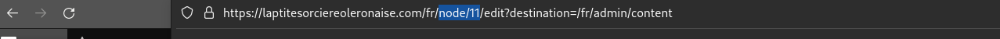
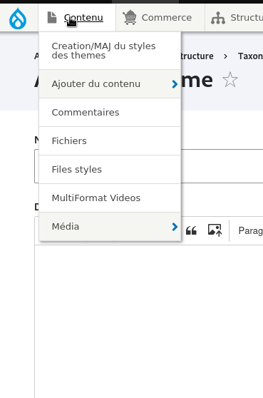
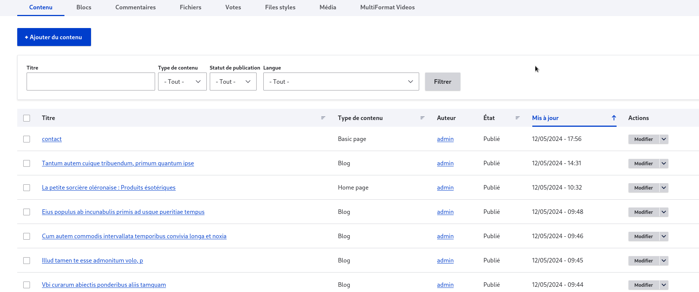
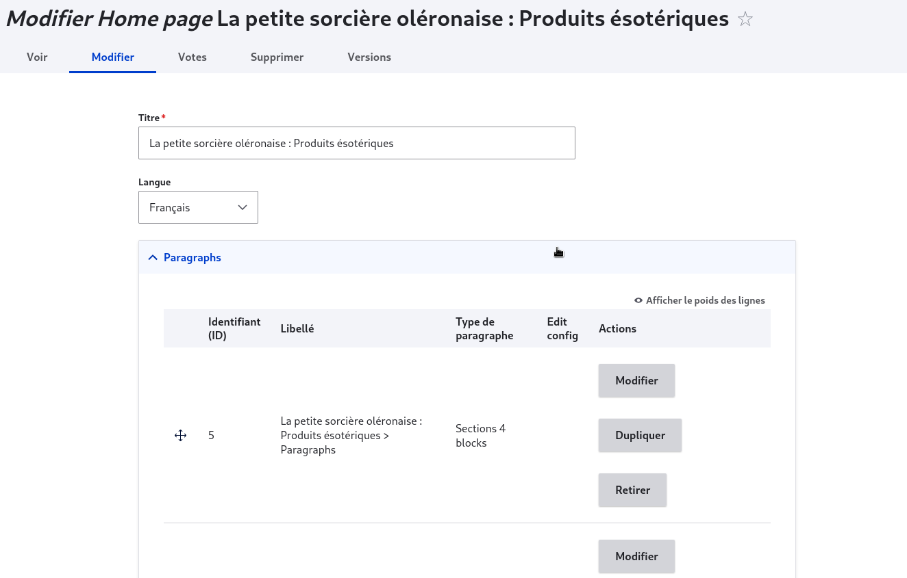
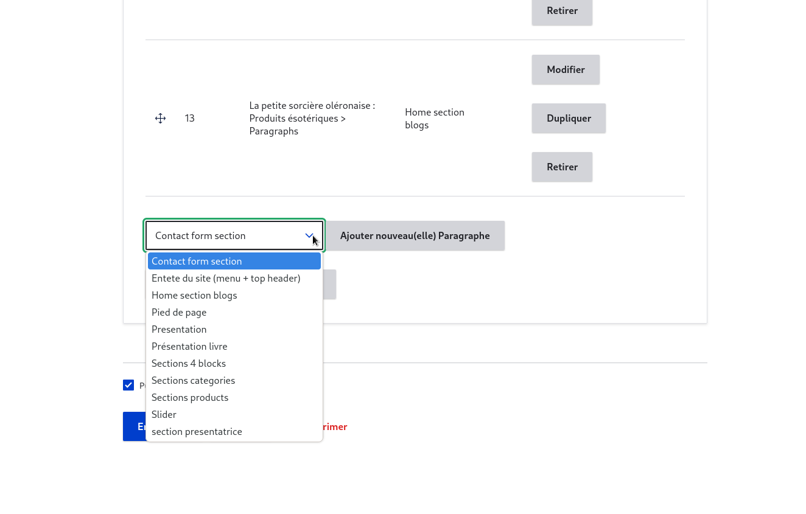
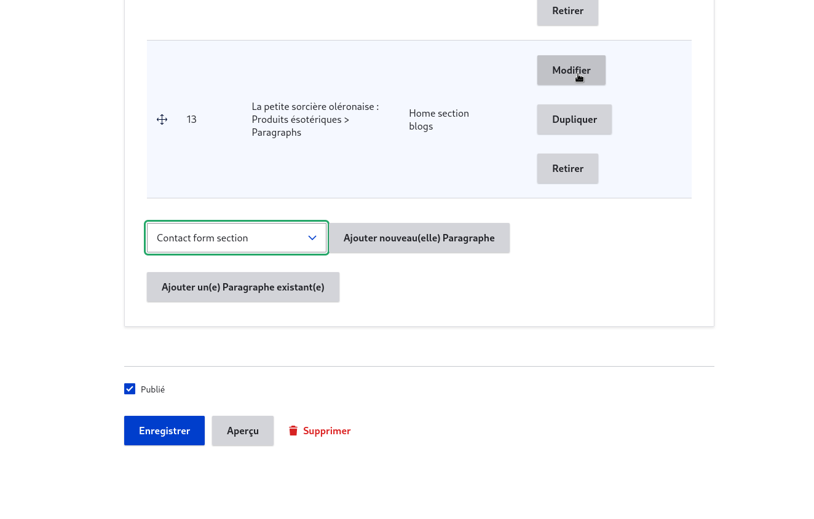
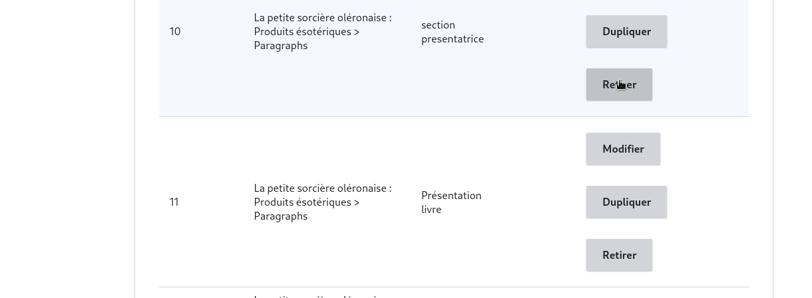

# page

 pages sur Drupal sont des éléments de contenu que vous pouvez créer et gérer au sein de votre site web Drupal. Voici quelques informations clés sur la gestion des pages 

## creation des pages

Pour créer une page, il faut 

Aller sur la page "Contenu" à l'adresse "nomdusite/admin/content" ou en utilisant le menu admin "admin->contenu" puis cliquer sur le bouton "+Ajouter du contenu"
Choisir le type de contenu "Page de base"
Au minimum saisir le titre et le contenu et valider à l'aide du bouton Enregistrer

<figure class="figure">
  
  <figcaption class="figure-caption">  </figcaption>
</figure>

Vous pouvez aussi à l'aide de la colonne située à droite :

choisir de publier ou non la page, en cochant la case "Publié". Une page publié sera accessible sur le site par les visiteurs.

saisir un message de révision qui explique les corrections effectuées. Comme les "pages de base" sont un type de contenu avec révision, il est possible de suivre les différences entre les multiples versions des pages et de revenir à des versions antérieures. Pour cela, il faut se rendre à l'adresse de la page et cliquer sur l'onglet révision.

<figure class="figure">
  
  <figcaption class="figure-caption">  </figcaption>
</figure>

pour ajouter le lien de la page dans le menu il faut d'abord étant sur page de modification de la page recuperer l'alias d'url situé dans le lien de la page (il sagit de l'élement nommé "node" suivi d'un numero)

<figure class="figure">
  
  <figcaption class="figure-caption">  </figcaption>
</figure>

<figure class="figure">
  
  <figcaption class="figure-caption">  </figcaption>
</figure>

Ensuite pour l'ajouter sur le menu il faut se rendre su l'onglet structure puis sur menu ensuite sur navigation principale

<figure class="figure">
  
  <figcaption class="figure-caption">  </figcaption>
</figure>

<figure class="figure" >
  
  <figcaption class="figure-caption"> </figcaption>
</figure>

ensuite on lui donne un titre qui est le nom de page creer puisque c'est lui qui s'affichera sur le menu

<figure class="figure" >
  
  <figcaption class="figure-caption"> </figcaption>
</figure>

## modification des pages.

pour modifier une page il suffit de se rendre dans l'onglet "contenue (content)

<figure class="figure">
  
  <figcaption class="figure-caption">  </figcaption>
</figure>

puis selectionner la page à modifier et cliquer sur modifier

<figure class="figure">
  
  <figcaption class="figure-caption"> </figcaption>
</figure>

il apparaitra alors une page comme celle suivante 

<figure class="figure">
  
  <figcaption class="figure-caption"> </figcaption>
</figure>

vous avez donc la possible de faire plusieur ation

### ajouter une section 

pour ajouter une section il suffit de se rendre au bas de la page et derouler la liste des section ou cliquer sur "ajouter une section existante"

<figure class="figure">
  
  <figcaption class="figure-caption"> </figcaption>
</figure>

### modification d'une section 

pour modifier une section il suffit de cliquer sur le bouton modifier à droite de la section 

<figure class="figure">
  
  <figcaption class="figure-caption"> </figcaption>
</figure>

puis remplir les champs de la section 

<figure class="figure">
  
  <figcaption class="figure-caption"> </figcaption>
</figure>

ensuite enregistrer la section et enregistrer la page 

### suppression d'une section 

pour supprimer une section il suffit de cliquer sur le bout "retirer" à droite de la section

<figure class="figure">
  
  <figcaption class="figure-caption"> </figcaption>
</figure>

puis il apparait une fenetre comme suit 

<figure class="figure">
  
  <figcaption class="figure-caption"> </figcaption>
</figure>

cliquer sur retire et sauvegarder la page

## suppression d'une page

pour supprimer une page on se rend à l'onglet contenu 

<figure class="figure">
  
  <figcaption class="figure-caption"> </figcaption>
</figure>

puis on cible notre page ensuite on deroule le petit menu greis situé à gauche de notre element 
puis cliquer sur supprimer

<figure class="figure">
  
  <figcaption class="figure-caption"> </figcaption>
</figure>

il apparaitra donc une fenetre qui vous demandera de confirmer votre choix el là cliquez sur oui
et la page est supprimmer