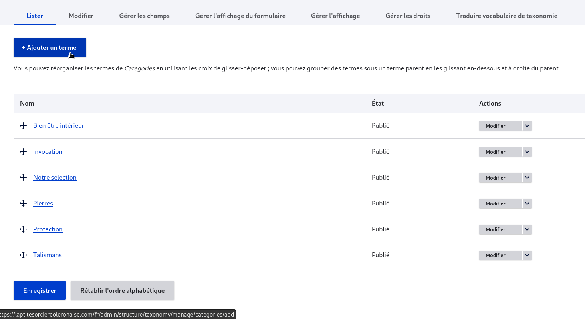
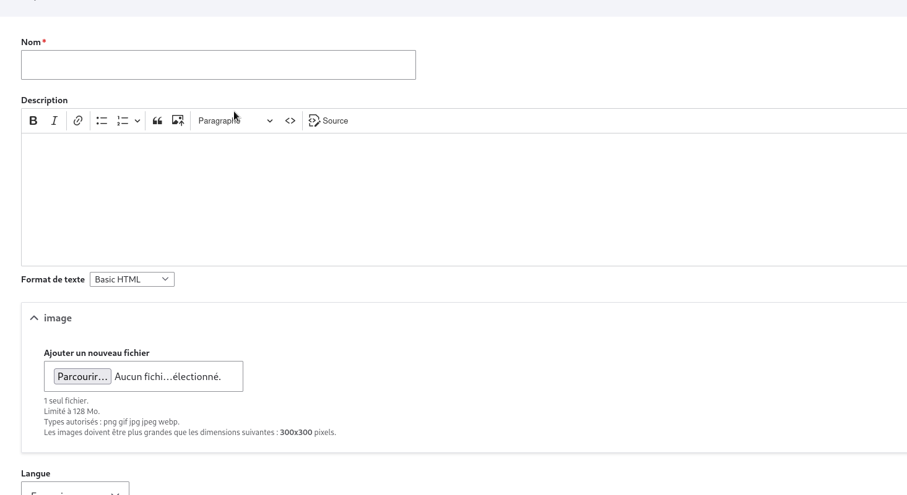

# Ajout des taxonomies 

## definition 

 C'est une façon générique de catégoriser des contenus (c'est-à-dire, principalement de leurs associer des tags, mais on peut aussi faire beaucoup plus)

 ## Ajout

pour ajouter une taxonomie on se rend dans l'onglet "structure" puis "taxonomies" puis "ajouter un vocabulaire"

<figure class="figure">
  
  <figcaption class="figure-caption"> </figcaption>
</figure>

<figure class="figure">
  
  <figcaption class="figure-caption"> </figcaption>
</figure>

ensuite liste les termes (les termes corespondent auxéléments de la taxonomie exple pour une taxonomie nommée ville on aura les terme "paris" "londres" ...)

<figure class="figure">
  
  <figcaption class="figure-caption"> </figcaption>
</figure>

puis on remplis les champs de la taxonomies

<figure class="figure">
  
  <figcaption class="figure-caption"> </figcaption>
</figure>