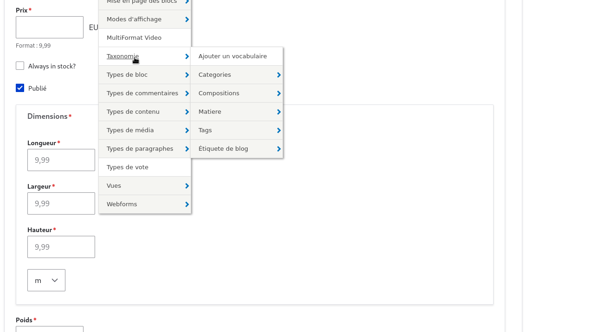
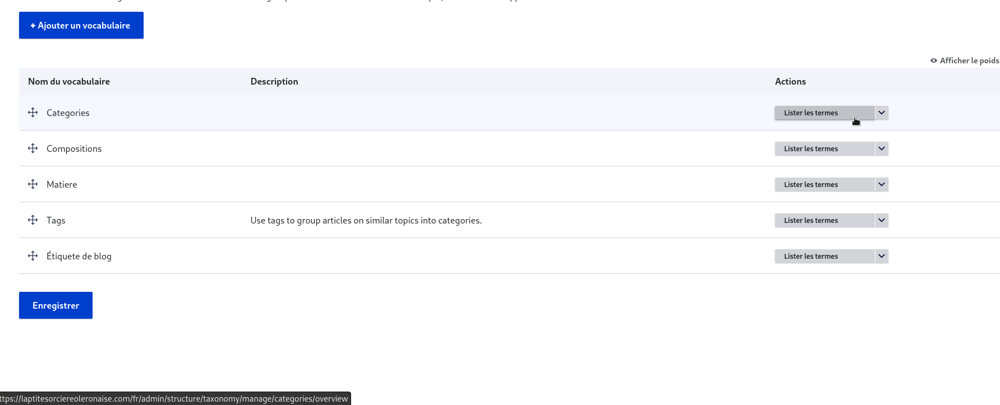

# Ajout des taxonomies 

## definition 

 C'est une façon générique de catégoriser des contenus (c'est-à-dire, principalement de leurs associer des tags, mais on peut aussi faire beaucoup plus)

 ## Ajout

Pour ajouter des taxonomies sur Drupal, voici les étapes à suivre :

Accédez à la Taxonomie : Dans le menu d'administration, allez à Structure > Taxonomie

<figure class="figure">
  
  <figcaption class="figure-caption"> </figcaption>
</figure>

 ## Ajout des vocabulaires
 
Ajoutez un Vocabulaire: Cliquez sur Ajouter un vocabulaire. Remplissez les champs nécessaires comme le nom du vocabulaire (par exemple, "Ingrédients") et une description si nécessaire.Ensuite, cliquez sur Enregistrer

<figure class="figure">
  
  <figcaption class="figure-caption"> </figcaption>
</figure>
 
Ajoutez des Termes: Après avoir créé un vocabulaire, vous pouvez ajouter des termes à celui-ci. Cliquez surAjouter un termeet saisissez le nom du terme (par exemple, "Beurre").Cliquez sur Enregistrer pour chaque terme ajouté

<figure class="figure">
  
  <figcaption class="figure-caption"> </figcaption>
</figure>
 
